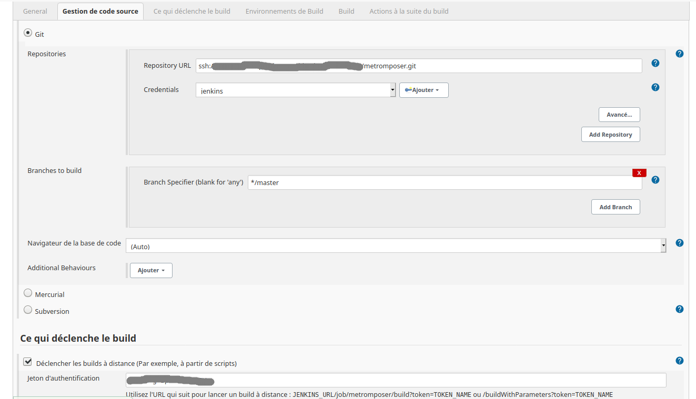

viduc/metromposer
=======

La librairie metromposer vous permet de récupérer les mises à jour à réaliser
pour votre application. Ces mises à jour concernent les librairies installées
avec composer. Un rapport html est généré puis est envoyé sur un dépôt git. Vous
pouvez ensuite suivre l'ensemble de ces rapports depuis un job jenkins. 

AUTEUR
------
 

STATUT
------

LICENSE
-------

Copyright [2021] [Tristan FLeury]

Licensed under the Apache License, Version 2.0 (the "License");
you may not use this file except in compliance with the License.
You may obtain a copy of the License at

    http://www.apache.org/licenses/LICENSE-2.0

Unless required by applicable law or agreed to in writing, software
distributed under the License is distributed on an "AS IS" BASIS,
WITHOUT WARRANTIES OR CONDITIONS OF ANY KIND, either express or implied.
See the License for the specific language governing permissions and
limitations under the License.

PREREQUIS
---------

Cette librairie nécessite une version php minimum 7.4.

INSTALLATION
------------

L'installation de la librairie se fait via composer:

`composer require viduc/metromposer`

CONFIGURATION
-------------

#### Phase d'installation:

Un script d'installation est fournit. Ouvrez une console pouis placez vous à la
racine de votre application. Exécutez ensuite cette commande:

`php vendor/viduc/metromposer/install.php`

Lors de la première installation, le script vous demandera d'entrer
l'adresse (url) de votre dépôt git. Ce dépôt sera commun a toutes vos 
applications et ne devra contenir que les fichiers envoyés par les librairies
metromposer. Le dépôt devra être accessible en écriture depuis le compte utilisé
pour lancer le script. Il est donc préférable qu'un échange de clé ssh soit mis
en place pour simplifier le processus. Si vous utilisez une adresse via le protocol
http ou https il vous faudra préciser dans l'url le login et mot de passe si
besoin.

Il vous sera ensuite demandé quelle version de composer vous souhaitez utiliser.
Renseigné l'id correspondant à la version que voulez utiliser.

Entrez ensuite un nom pour votre application. Ce nom servira à créer le fichier
html du rapport, il ne doit pas être utilisé par une autre application.

Vous pouvez ensuite spécifier l'url d'accès à votre application. Cette url est
l'adresse réelle, elle sera indiquer dans le rapport html pour permettre un
accès rapide en cas de besoin depuis jenkins.

Le script vous demandera ensuite si vous souhaitez générer tout de suite un
premier rapport. Entrez oui pour le générer, non pour arrêter.

Enfin le script vous proposera d'envoyer ce rapport sur votre dépôt. Entrez oui
pour l'envoyer, non pour arrêter.

Le script vous indiquera que l'installation est terminée.

A tout moment vous pouvez annuler l'installation en entrant :q

#### Phase de réinstallation:
Il est possible de relancer le script d'installation si vous souhaitez modifier
la configuration. Le script détectera qu'une configuration est présente et vous
proposera de la supprimer et de recommencer l'installation. Entrez oui pour lancer
le processus ou non pour arrêter:

EXECUTION
-------------
Vous pouvez lancer le script directement en éxécutant le fichier metromposer.php
ed la librairie:

Il est consillé de lancer le script automatiquement en configurant une tâche
cron de votre serveur.

JENKINS
-------------
La dernière étape consiste donc à paramètrer jenkins. créer un job from scratch
sur votre serveur. Configurer votre Gestion de code source pour si possiblequ'il
se déclenche si possible lors des push sur la branch de votre dépôt:

Ajouter ensuite une action du type "Publish HTML reports" à la suite du build:

Relancer un job (directement ou via un push), vous devriez obtenir votre premier
rapport:

Chaque application qui enverra son rapport sur votre dépôt viendra s'ajouter à 
la liste des rapports disponibles (dans la barre d'onglet)

CONTRIBUTION
-------------

Cette librairie est développée par Tristan FLeury alias Viduc. N'hésitez pas à
me faire vos retours et suggestions et à me proposer vos améliorations.